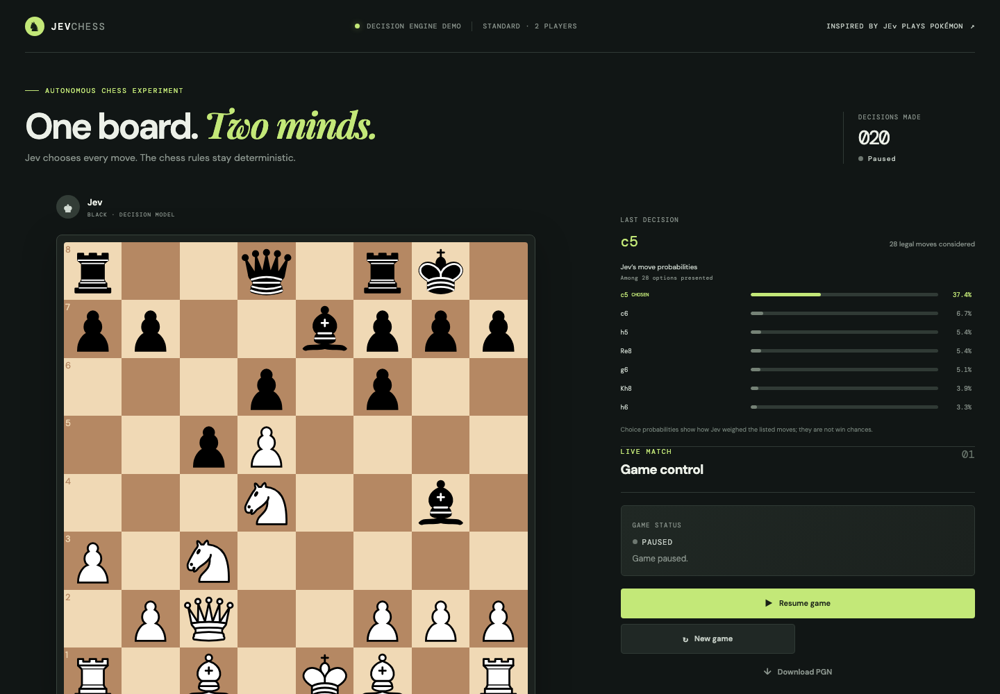

# Jev Chess

An autonomous chess experiment where Jev plays both colors. A local harness supplies the real board position and legal moves, Jev chooses one, and the harness applies it through an open-source chess rules library. A browser board displays the game as it unfolds.

## Open-source chess components

- [`chess.js`](https://github.com/jhlywa/chess.js) generates and validates legal moves and detects check, checkmate, and draws. It is BSD-2-Clause licensed.
- [`react-chessboard`](https://github.com/Clariity/react-chessboard) renders the board. It is MIT licensed.

No chess rules or board rendering are implemented in this project.

## Run locally

Requirements: Node.js 20.19+ and npm. For live Jev access, provide an `AI_GATEWAY_API_KEY` or Vercel OIDC token.

```bash
cp .env.example .env
npm install
npm run dev
```

Open <http://127.0.0.1:5173>. The service listens on `127.0.0.1:8788`; the Vite dev server proxies `/api` requests to it. The defaults use Vercel AI Gateway and the same `typesafe-ai/jev` model as Jev Pokémon.

## How a game works

1. `chess.js` provides the current FEN, PGN, turn, and legal moves.
2. The server adds a readable board, piece counts, material points (pawn 1, knight/bishop 3, rook 5, queen 9), and an attack map for occupied squares. Attack-map facts may include pinned pieces, so they describe attacked squares rather than guaranteed legal captures.
3. Each candidate includes SAN, from/to squares, material value of captures, promotions, check or checkmate, and how the move changes attacks on either side's pieces. The harness also lists immediate legal capture replies, whether the moved piece can be recaptured, any opponent checkmate in one, and whether the move immediately draws by threefold repetition.
4. The harness removes moves that allow an immediate checkmate when at least one move avoids it. It also avoids immediate threefold-repetition draws when the moving side leads by at least three material points and a non-drawing move remains. If every move has one of these risks, Jev sees the available moves and gets a warning.
5. Jev chooses a move ID from a typed `choice` question. The server maps that ID to the original legal move object and applies it with `chess.js`.
6. If the eligible move list exceeds the configured option limit, the harness distributes them round-robin into balanced choice groups, then asks Jev to choose among the finalists. The prompt distinguishes group decisions from the final choice.
7. The web client polls game state and shows the board, status, move list, and Jev's probability distribution for the latest choice. When a decision uses brackets, the displayed probabilities are for the final choice among finalists. Start, pause, reset, move pace, and PGN download are available in the panel.

The harness is authoritative for legal moves and game-over detection. These annotations are deterministic facts, not engine evaluations or move rankings. Jev chooses among the supplied candidates; when any move avoids immediate mate, the harness removes candidates that allow mate in one. If no move passes that check, every legal move remains selectable. Jev cannot submit a move outside the candidate list and never receives shell access. The interface shows Jev's choice probabilities, which describe Jev's distribution over the presented options and are not chess-engine win chances. It stops after `JEV_MAX_PLIES` to bound unusually long games. Every API request, response, and error is appended to `logs/jev-calls.jsonl`; logs may contain full game state and are git-ignored.

## Configuration

| Variable | Default | Purpose |
| --- | --- | --- |
| `JEV_API_URL` | `https://ai-gateway.vercel.sh/v1/evaluate` | Vercel AI Gateway evaluation endpoint |
| `JEV_MODEL` | `typesafe-ai/jev` | Jev model |
| `AI_GATEWAY_API_KEY` | empty | Gateway bearer token; `JEV_API_KEY` remains a compatibility fallback |
| `JEV_MAX_OPTIONS` | `48` | Maximum move choices per Jev decision |
| `JEV_MOVE_DELAY_MS` | `900` | Delay between plies |
| `JEV_REQUEST_TIMEOUT_MS` | `30000` | Per-request timeout |
| `JEV_MAX_PLIES` | `200` | Maximum half-moves in one game |

## Recorded experiment

A bounded self-play trial on 2026-10-02 with the move pace set to Quick (250 ms). Jev applied 20 moves (20 plies, or 10 moves per side), then the game was paused while the next decision was in flight. That API response successfully selected `Ndb5`, but the paused game discarded it rather than applying a move after the pause. The position was still in progress, so this is an execution sample rather than a result or a measure of chess strength.

All 21 API responses in the run selected supplied candidates; the first 20 moves were accepted by `chess.js`, and the final choice was not applied because the game had been paused. No API or move-application errors occurred. Across the 21 logged requests, response latency had a 355 ms median, a 4.7 s mean, and a 212 ms–26.4 s range. The mean reflects a long tail in a few responses.

The recording is sped up through long engine idle periods; the board and surrounding UI remain at the original resolution.

[](assets/jev-chess-run.webm)

<video controls preload="metadata" poster="assets/jev-chess-run.png" width="100%">
  <source src="assets/jev-chess-run.webm" type="video/webm">
  Your browser may not support inline WebM playback. [Open or download the recording](assets/jev-chess-run.webm).
</video>

[Open or download the 20-ply WebM recording](assets/jev-chess-run.webm).

## Notes

This is a fan experiment and is not affiliated with TypeSafe AI or any chess-library maintainers. It demonstrates bounded Jev decisions; it does not claim chess strength. The `confidence` shown for a bracketed turn describes the final bracket decision only, not a calibrated probability that the selected move is objectively best.
